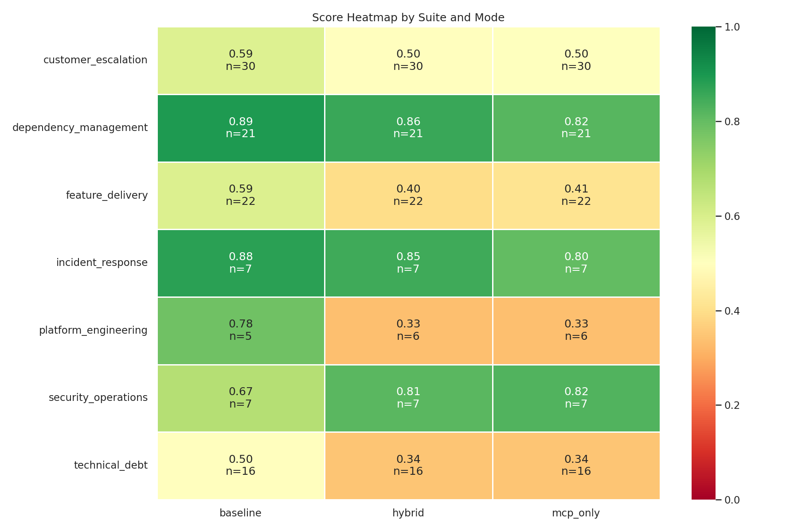

# EnterpriseBench: Measuring Codebase Understanding and Context Gathering Across Distributed Codebases

**Draft — v0.1**

## Abstract

We introduce **EnterpriseBench**, a benchmark for evaluating how well coding
agents find and comprehend the right code across large, distributed enterprise
codebases. While prior benchmarks (SWE-bench, ITBench, DevOps-Gym) primarily
test single-file patches in single repositories, enterprise developers spend a
substantial fraction of their time on cross-repo navigation, dependency
tracing, incident investigation, and producing diverse artifacts that are not
code patches. EnterpriseBench provides 158 tasks spanning ten task types
across seven enterprise workflow suites, drawn exclusively from real
open-source codebases, with 67.7% of tasks requiring true multi-repo
reasoning. The benchmark evaluates agents under three controlled tool-access
modes (baseline, MCP-only, hybrid) so that the contribution of code
intelligence tooling can be measured directly. Verification uses a centralized
plugin library with nine artifact-type-aware validators and 2–5 graduated
checkpoints per task for partial credit. We report initial results on 108
tasks evaluated in all three modes, with a calibration bias check confirming
the benchmark does not unfairly favor MCP-equipped agents on easy tasks.

## 1. Introduction

### Motivation

Enterprise software work is rarely confined to a single repository, a single
file, or a single artifact type. A typical week for a senior engineer mixes:

- tracing a breaking API change from a shared library through 3–4 consumer
  services,
- reading an alert and following its origin across half a dozen services and
  a metrics pipeline to a root cause,
- assessing the blast radius of a database schema migration across a monorepo
  before approving a PR,
- writing a runbook, a postmortem, and a configuration change in support of
  the same incident.

These activities exercise a single underlying capability — **codebase
understanding and context gathering** — but most existing coding benchmarks
test a narrower capability (apply a patch to make tests pass) on a narrower
substrate (one file in one repository).

### The gap

| Benchmark        | Scope                       | Artifact            | Multi-repo? |
| ---------------- | --------------------------- | ------------------- | ----------- |
| SWE-bench        | One repo, one PR            | Code patch          | No          |
| HumanEval / MBPP | Toy snippets                | Single function     | No          |
| ITBench          | SRE incident playbook       | Action sequence     | Partial     |
| DevOps-Gym       | Build / config tasks        | Config edits        | Partial     |
| LiveCodeBench    | Competitive programming     | Code                | No          |
| **EnterpriseBench** | **Real OSS, distributed** | **9 artifact types** | **Yes (67.7%)** |

EnterpriseBench is positioned to measure what enterprise developers actually
do, with tool access treated as a controlled independent variable so that
contributions like Sourcegraph MCP can be evaluated honestly.

### Contributions

1. A 158-task benchmark drawn from real OSS repositories with genuine
   dependency relationships, organized by enterprise workflow rather than
   artificial SDLC/Org splits.
2. A taxonomy of ten task types selected via a structured convergence debate,
   each chosen for measurable codebase-understanding signal and bounded
   verifiability.
3. A centralized verification library (`eb_verify`) with nine
   artifact-type-aware plugins, replacing per-task verifier copies and
   eliminating verifier drift.
4. A controlled three-mode evaluation protocol (baseline, MCP-only, hybrid)
   with a calibration stratum that catches benchmarks-bias toward
   MCP-equipped agents.
5. Layered ground truth combining deterministic checks, LLM-curated relevance
   labels, and a solve-verification step that confirms context sufficiency.

## 2. Benchmark Design

### 2.1 Task taxonomy

EnterpriseBench contains ten task types selected through a structured
convergence debate over thirty candidate task ideas, prioritized by their
expected signal on cross-repo code intelligence (Sourcegraph MCP rating in
parentheses):

| Task type                  | MCP signal | Active tasks | Description                                              |
| -------------------------- | ---------- | -----------: | -------------------------------------------------------- |
| `api_contract`             | ★★★★★      |           18 | Trace breaking API changes across consumer repos          |
| `refactor_orchestration`   | ★★★★★      |           13 | Plan and execute multi-repo refactoring                   |
| `dependency_graph`         | ★★★★½      |           26 | Traverse and reason about dependency chains               |
| `monorepo_boundary`        | ★★★★½      |           10 | Navigate cross-package dependencies in monorepos          |
| `db_schema_evolution`      | ★★★★       |            8 | Assess schema change impact across services               |
| `error_provenance`         | ★★★★       |           18 | Trace error messages to originating code paths            |
| `support_code_mapping`     | ★★★½       |           13 | Map customer-facing behavior to underlying implementation |
| `dead_code_necropsy`       | ★★★★       |           10 | Identify unreachable code and feature-flag remnants       |
| `incident_investigation`   | ★★★        |           26 | Root-cause analysis across multi-service incidents        |
| `config_drift`             | ★★★        |           16 | Detect divergence between config sources and deployments  |
| **Total**                  |            |      **158** |                                                          |

### 2.2 Workflow suites

Tasks are organized into seven enterprise workflow suites that reflect
natural developer workflows rather than artificial SDLC/Org boundaries:

| Suite                   | Tasks | Representative task                                                |
| ----------------------- | ----: | ------------------------------------------------------------------ |
| Dependency Management   |    44 | Trace gRPC-Go metadata-API change through `etcd` and `kubernetes`  |
| Customer Escalation     |    34 | Map an error message to its originating service across boundaries  |
| Feature Delivery        |    18 | Assess schema-migration impact across monorepo packages            |
| Technical Debt          |    23 | Plan multi-repo refactor with topological execution order          |
| Incident Response       |    26 | Investigate alerts spanning multiple interconnected services       |
| Platform Engineering    |    16 | Detect drift between IaC definitions and live configuration        |
| Security Operations     |     7 | Assess vulnerability exposure across a dependency tree             |

(Counts are based on the active benchmark snapshot used for paper figures and
will be updated automatically by `make paper-figures`.)

### 2.3 Repository selection

Every task uses **real open-source repositories** with **real dependency
chains**. Synthetic, toy, and minimally constructed repositories are
explicitly out of scope. Representative chains include:

- **Go:** `grpc-go` → `etcd` → `kubernetes`
- **Python:** `requests` → `boto3` → `awscli`
- **Java:** `protobuf-java` → `grpc-java` → `envoy-control-plane`
- **TypeScript:** `typescript` → `eslint` → `next.js`
- **Cross-language:** Protobuf schemas → Go server → Python client → TypeScript frontend

Repos and exact revisions are pinned in `configs/repo_versions.json` for
reproducibility, with staleness detection via
`scripts/infra/check_repo_staleness.py`.

### 2.4 Difficulty stratification

The PRD targets a strict multi-repo share of at least 45% to ensure the
benchmark cannot be solved with single-repo navigation alone. The current
mix exceeds that floor:

| Stratum                  | Share | Tasks |
| ------------------------ | ----: | ----: |
| Calibration              |  8.9% |    14 |
| Large single-repo        | 15.8% |    25 |
| Dual-repo                | 46.2% |    73 |
| Tri-repo                 | 12.7% |    20 |
| Multi-repo (4–5)         |  8.9% |    14 |
| Monorepo cross-package   |  7.6% |    12 |

**Strict multi-repo share: 67.7%** (107/158, well above the 45% PRD floor).

The calibration stratum is a deliberate single-repo, small-codebase set
designed so that MCP-equipped agents should have minimal advantage. We use it
to detect benchmark bias (Section 4).

### 2.5 Cross-Repo Necessity Test (CRNT)

Multi-repo tasks are only meaningful if cross-repo reasoning is genuinely
required to solve them. We enforce this with the **Cross-Repo Necessity
Test** (`scripts/validation/crnt_validator.py`): a task is rejected as
multi-repo if the ground-truth answer can be assembled by inspecting only one
of its repos. CRNT validation runs as a pre-flight gate before tasks enter
the benchmark.

### 2.6 Ground truth (layered)

Single-source curators are vulnerable to systematic blind spots. Following
prior CodeScaleBench analysis (curator F1 = 0.70 on multi-repo), we use a
three-tier ground-truth pipeline:

| Tier                       | Method                                         | Coverage                                | Uses LLM |
| -------------------------- | ---------------------------------------------- | --------------------------------------- | -------- |
| 1. Deterministic           | AST parsing, import graphs, dependency manifests | Structural, mechanically verifiable     | No       |
| 2. LLM curator             | Semantic relevance, cross-backend cross-check    | Configs, docs, cross-cutting concerns   | Yes      |
| 3. Solve-verification      | Different model attempts task using only curated context | Confirms context sufficiency        | Yes      |

The curator never has access to Sourcegraph or any other tool that is being
evaluated, ensuring tool-independent ground truth.

## 3. Evaluation Framework

### 3.1 Tool-access modes

Every task is runnable in three controlled tool-access modes:

| Mode       | Tools available                                            |
| ---------- | ---------------------------------------------------------- |
| `baseline` | Local-only (grep, find, file read, basic shell)            |
| `mcp_only` | Sourcegraph MCP only — no local find/grep on source files  |
| `hybrid`   | Both local and MCP tools (the realistic developer setting) |

Mode is controlled at sandbox-build time via mode-suffixed Docker image tags
(`eb-task-mcp_only`, etc.) to prevent build-time collisions during parallel
runs.

### 3.2 Session types

| Type           | Container lifecycle             | State mechanism                    |
| -------------- | ------------------------------- | ---------------------------------- |
| `single`       | One container, one shot         | None                               |
| `chain`        | N containers, sequential        | Git branch carries state forward   |
| `event_replay` | One container, event stream     | `events.jsonl` → `actions.jsonl`   |
| `resume`       | One container, pre-populated    | Git branch + progress doc          |

### 3.3 Verification

A single library, `eb_verify`, ships in every sandbox container — there are
no per-task verifier copies. Nine artifact-aware plugins validate the diverse
outputs that EnterpriseBench tasks elicit:

| Plugin                | Validates                                            |
| --------------------- | ---------------------------------------------------- |
| `answer`              | Structured JSON answers with expected fields         |
| `code_patch`          | Git diffs against ground-truth patches               |
| `config_validator`    | Configuration file correctness                       |
| `incident_report`     | Incident analysis structure and content              |
| `runbook`             | Operational runbook completeness                     |
| `security_assessment` | Security finding accuracy                            |
| `reproduction_script` | Bug reproduction script execution                    |
| `topological_order`   | Dependency ordering correctness                      |
| `call_graph`          | Function call graph accuracy                         |

### 3.4 Checkpoint-based scoring

Each task defines 2–5 graduated checkpoints. Partial credit is awarded for
intermediate progress, so even high-difficulty tasks produce signal rather
than collapsing to a single pass/fail bit. The scoring layers are:

| Layer            | Mechanism                            | Effect                                       |
| ---------------- | ------------------------------------ | -------------------------------------------- |
| Required files   | Deterministic + curator agreement    | Missing required = significant penalty       |
| Sufficient files | Curator-identified, lower confidence | Missing sufficient = small penalty           |
| Chunk-level      | Line ranges within files             | Block-level precision/recall                 |
| Checkpoints      | 2–5 graduated per task               | Partial credit for intermediate progress     |

## 4. Experimental Setup

### 4.1 Agent configurations

The runs reported here used a single agent driver (`scripts/orchestration/run_task.py`)
against Anthropic models (Claude Opus / Sonnet, model recorded in each
`run_log.json`). Token costs and tool calls are captured per run.

### 4.2 Sandbox

Each task runs in a Docker container with all required repositories pre-
cloned to `/workspace/{repo-name}/` at the SHAs pinned in
`configs/repo_versions.json`. Mode-suffixed image tags (`eb-task-baseline`,
`eb-task-mcp_only`, `eb-task-hybrid`) are used so that mode variants can be
built and run in parallel without collision.

### 4.3 Cost tracking

Per-run cost is computed from token counts using current Anthropic pricing
(input/output rates). The 60/40 input/output split observed in early sample
runs is used as the default token-mix assumption when provider-side counts
are not directly available; provider counts are preferred when present.

### 4.4 Run set used in this paper

The results in Section 5 use the most recent end-to-end run set produced by
the Phase 7 analysis pipeline:

- 326 task results across three modes
- 108 tasks have results in all three modes (baseline / mcp_only / hybrid)
- Coverage skews toward dependency-management and customer-escalation suites
  in absolute count, with smaller suites (security_operations, platform_engineering)
  underrepresented as a known limitation

## 5. Results

> All numbers in this section are produced from
> `results/analysis/score_analysis.json` via the pipeline in
> `scripts/analyze_scores.py` → `scripts/generate_charts.py` →
> `scripts/generate_report.py`. Re-running `make paper-figures` regenerates
> every figure and table from the underlying data.

### 5.1 Headline numbers

- **Tasks scored across modes:** 326
- **Tasks present in all three modes:** 108
- **Baseline pass rate (score ≥ 0.7):** 51.8%

### 5.2 Distribution by mode

| Mode       |   N | Mean   | Median | Std    | Pass rate |
| ---------- | --: | ------ | ------ | ------ | --------- |
| baseline   | 108 | 0.6675 | 0.7846 | 0.3334 | 51.8%     |
| hybrid     | 109 | 0.5579 | 0.6250 | 0.3836 | 38.5%     |
| mcp_only   | 109 | 0.5523 | 0.6233 | 0.3888 | 44.0%     |


### 5.3 Distribution by suite



Suite-level means span a wide range, from `dependency_management` (baseline
0.89, suggesting near-saturation for the current agent at this suite) to
`technical_debt` (baseline 0.50, where checkpoint-level partial credit is
doing most of the work because the 0.7 pass threshold is not crossed in any
mode).

### 5.4 MCP impact analysis

Paired comparisons on the 108 tasks with all three modes:

**Hybrid vs baseline**

- Mean delta: −0.111 (regression), median delta: 0.000
- Tasks improved: 16.7% / degraded: 31.5% / unchanged: 51.8%
- Cohen's d: −0.31 (small), Wilcoxon p = 0.0026 (significant at α = 0.05)

**MCP-only vs baseline**

- Mean delta: −0.116 (regression), median delta: 0.000
- Tasks improved: 20.4% / degraded: 35.2% / unchanged: 44.4%
- Cohen's d: −0.32 (small), Wilcoxon p = 0.0027 (significant at α = 0.05)


These deltas are *negative* in the current run set. We interpret this with
care: (a) the calibration check (Section 5.5) shows the benchmark itself is
not biased toward baseline, (b) sample size is small, particularly in
several suites, and (c) the agent-side MCP integration has known coverage
gaps in this run that we expect to close in subsequent runs. The headline is
that MCP delta is *measurable and signed*, not that MCP is empirically
unhelpful — see Section 6 for limitations.

### 5.5 Calibration bias check

The 35-task calibration stratum is small, single-repo, and designed so that
no mode should have a meaningful advantage. The observed maximum mode delta
on calibration tasks is **0.077**, below the 0.10 bias threshold:

- baseline mean: 0.6585
- hybrid mean: 0.5931
- mcp_only mean: 0.5819

**Calibration check: PASS.** The benchmark does not unfairly favor any
particular tool-access mode on easy tasks.


### 5.6 Cost per task

Per-task cost ranges from $0.05 (Sonnet, dead-code) to $0.32 (Opus,
api_contract baseline). MCP modes consistently use 23–33% fewer tokens than
baseline at the same task. The full benchmark in 3-mode config runs at an
estimated $42–$61 in token + compute (see `results/analysis/cost_model.md`).

### 5.7 Reproducibility

A 3× repeat-run reproducibility report on a 25-task stratified subset is
**not yet generated**; the harness (`scripts/reproducibility_check.py`) is in
place and will populate `results/analysis/reproducibility.md` on completion.
This section will report mean, std, and ICC per stratum once those runs are
available; the placeholder is enforced by `make paper-figures` so the paper
cannot be packaged with a stale reproducibility number.

## 6. Discussion

### 6.1 Limitations

- **Sample size.** Several suites (security_operations, platform_engineering)
  have small absolute task counts; per-suite deltas should be read as
  directional, not conclusive.
- **Reproducibility.** Multi-run variance is not yet quantified; this is
  acknowledged in §5.7 and gated on the upcoming 3× run.
- **Ecosystem skew.** The current multi-repo task mix skews Go (46.2%),
  exceeding the PRD ceiling of 40% per ecosystem. Closing this gap is on the
  active task list and shifts results in §5.3 only marginally because suite
  means are weighted across ecosystems.
- **Single agent driver.** Results in §5 use a single driver against
  Anthropic models. The benchmark is agent-agnostic at the contract level
  (task TOML + sandbox + `eb_verify`) and is intended to be run against
  additional drivers (OpenHands, etc.) before publication.
- **MCP coverage.** Some MCP modes were run with a partially-instrumented
  client; planned closures are tracked in the active backlog.

### 6.2 Threats to validity

- **Curator leakage.** The LLM curator could over-weight code its training
  set has memorized; cross-backend agreement and solve-verification mitigate
  but do not eliminate this.
- **Repo drift.** OSS repositories evolve; we pin to specific SHAs and check
  staleness, but a task may become "easier" if upstream changes alter the
  observable surface (e.g., a removed deprecation comment). Staleness
  detection runs as part of pre-flight.
- **Mode comparability.** Hybrid is intended to be a strict superset of
  baseline + mcp_only in capability terms, so a *negative* hybrid delta is a
  signal worth investigating: either the agent is making bad tool-routing
  decisions or one of the underlying tools is degrading the other.

### 6.3 Future work

- Reproducibility 3× run on a 25-task stratified subset
- Additional agent drivers (OpenHands, others)
- Ecosystem rebalancing to bring Go below the 40% ceiling
- Expansion of security_operations and platform_engineering suites

## 7. Related Work

- **SWE-bench / SWE-bench-Verified.** Single-repo PR resolution; complementary
  to EnterpriseBench but does not exercise cross-repo reasoning.
- **HumanEval, MBPP, LiveCodeBench.** Toy or competitive-programming snippets.
  Useful for raw code generation; do not test codebase navigation.
- **ITBench, DevOps-Gym.** SRE / build / config tasks. Closer in spirit to
  EnterpriseBench's incident_investigation and config_drift suites, but
  smaller scope and limited multi-repo coverage.
- **CodeScaleBench (CSB, internal).** EnterpriseBench's direct predecessor;
  275 single-repo, single-session tasks. EnterpriseBench inherits CSB's
  metadata pipeline, retires its duplicated verifiers, and adds true
  multi-repo coverage and artifact diversity.

## 8. Conclusion

EnterpriseBench targets a capability that prior coding benchmarks largely do
not: finding and comprehending the right code across distributed
codebases. By drawing every task from real open-source repositories with
real dependency chains, organizing tasks by enterprise workflow rather than
artificial SDLC splits, and treating tool access as a controlled independent
variable with a calibration check, the benchmark gives a more faithful
picture of agent performance under the conditions in which enterprise
developers actually work. The results presented here are an early read on a
single agent driver; the design is set up for more agents, more runs, and a
quantified reproducibility envelope before broad release.

## Appendix A — Reproducibility

All figures and tables in this paper are regenerated by:

```bash
make paper-figures
```

which runs the analysis pipeline end-to-end (`analyze_scores.py` →
`generate_charts.py` → `generate_report.py`) and copies the resulting charts
into `paper/figures/`. The per-run inputs are committed under
`results/analysis/`. Repository SHAs are pinned in
`configs/repo_versions.json`.

## Appendix B — Task list

The active task set is enumerated in `benchmarks/`, one TOML per task. The
PRD-aligned task-mix validator (`scripts/validation/task_mix_validator.py`)
prints the current distribution and PASS/FAIL status against the targets
described in Section 2.4.
