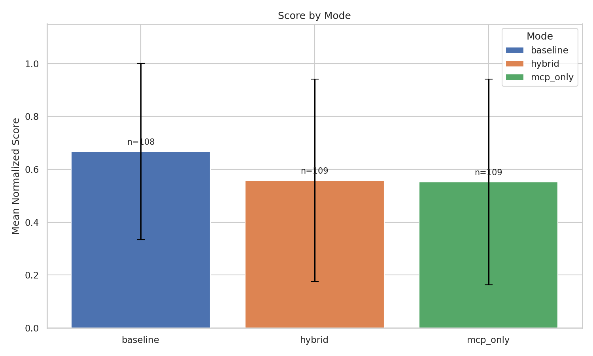
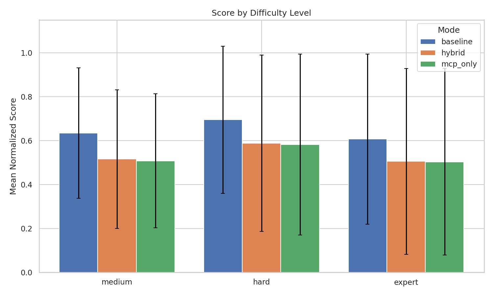
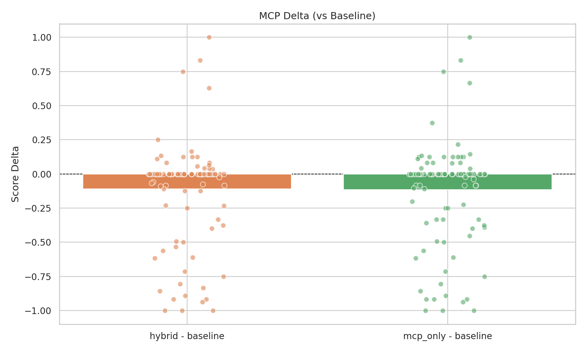
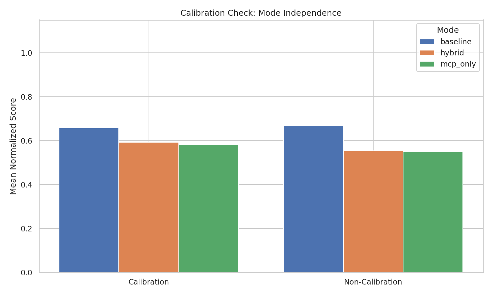

# EnterpriseBench Analysis Report

Generated: 2026-04-02T12:45:57.961685+00:00

## Executive Summary

- **326 task results** scored across 3 mode(s). Baseline pass rate: 51.8%.
- Hybrid vs baseline mean delta: -0.1106 (negative), based on 108 paired task(s).
- Calibration bias check: PASS (no significant mode sensitivity).

## 1. Coverage

- Total unique results: 326 across 3 mode(s)
- Baseline: 108 tasks scored
- Hybrid: 109 tasks scored
- Mcp Only: 109 tasks scored
- Tasks with all 3 modes: 108

## 2. Score Distributions

### By Mode

| Mode | N | Mean | Median | Std | Pass Rate |
| --- | --- | --- | --- | --- | --- |
| baseline | 108 | 0.6675 | 0.7846 | 0.3334 | 51.8% |
| hybrid | 109 | 0.5579 | 0.6250 | 0.3836 | 38.5% |
| mcp_only | 109 | 0.5523 | 0.6233 | 0.3888 | 44.0% |

### By Suite

| Suite | Mode | N | Mean | Pass Rate |
| --- | --- | --- | --- | --- |
| customer_escalation | baseline | 30 | 0.5898 | 46.7% |
| customer_escalation | hybrid | 30 | 0.4980 | 40.0% |
| customer_escalation | mcp_only | 30 | 0.5025 | 43.3% |
| dependency_management | baseline | 21 | 0.8913 | 76.2% |
| dependency_management | hybrid | 21 | 0.8575 | 66.7% |
| dependency_management | mcp_only | 21 | 0.8169 | 81.0% |
| feature_delivery | baseline | 22 | 0.5901 | 54.5% |
| feature_delivery | hybrid | 22 | 0.3958 | 22.7% |
| feature_delivery | mcp_only | 22 | 0.4122 | 31.8% |
| incident_response | baseline | 7 | 0.8786 | 85.7% |
| incident_response | hybrid | 7 | 0.8512 | 71.4% |
| incident_response | mcp_only | 7 | 0.8024 | 71.4% |
| platform_engineering | baseline | 5 | 0.7833 | 60.0% |
| platform_engineering | hybrid | 6 | 0.3333 | 0.0% |
| platform_engineering | mcp_only | 6 | 0.3333 | 0.0% |
| security_operations | baseline | 7 | 0.6698 | 71.4% |
| security_operations | hybrid | 7 | 0.8126 | 85.7% |
| security_operations | mcp_only | 7 | 0.8244 | 85.7% |
| technical_debt | baseline | 16 | 0.4965 | 0.0% |
| technical_debt | hybrid | 16 | 0.3444 | 0.0% |
| technical_debt | mcp_only | 16 | 0.3444 | 0.0% |

### By Difficulty

| Difficulty | Mode | N | Mean | Pass Rate |
| --- | --- | --- | --- | --- |
| expert | baseline | 16 | 0.6070 | 31.2% |
| expert | hybrid | 16 | 0.5051 | 25.0% |
| expert | mcp_only | 16 | 0.5030 | 37.5% |
| hard | baseline | 66 | 0.6952 | 57.6% |
| hard | hybrid | 66 | 0.5879 | 45.5% |
| hard | mcp_only | 66 | 0.5824 | 50.0% |
| medium | baseline | 26 | 0.6345 | 50.0% |
| medium | hybrid | 27 | 0.5158 | 29.6% |
| medium | mcp_only | 27 | 0.5078 | 33.3% |

### By Task Type

| Task Type | Mode | N | Mean | Pass Rate |
| --- | --- | --- | --- | --- |
| api_contract | baseline | 9 | 0.8869 | 55.6% |
| api_contract | hybrid | 9 | 0.8916 | 44.4% |
| api_contract | mcp_only | 9 | 0.8894 | 77.8% |
| config_drift | baseline | 8 | 0.5938 | 50.0% |
| config_drift | hybrid | 9 | 0.4259 | 22.2% |
| config_drift | mcp_only | 9 | 0.4259 | 22.2% |
| db_schema_evolution | baseline | 10 | 0.6785 | 60.0% |
| db_schema_evolution | hybrid | 10 | 0.5567 | 30.0% |
| db_schema_evolution | mcp_only | 10 | 0.6012 | 50.0% |
| dead_code_necropsy | baseline | 7 | 0.4525 | 0.0% |
| dead_code_necropsy | hybrid | 7 | 0.1429 | 0.0% |
| dead_code_necropsy | mcp_only | 7 | 0.1429 | 0.0% |
| dependency_graph | baseline | 13 | 0.9027 | 92.3% |
| dependency_graph | hybrid | 13 | 0.8192 | 76.9% |
| dependency_graph | mcp_only | 13 | 0.7552 | 76.9% |
| error_provenance | baseline | 16 | 0.6815 | 68.8% |
| error_provenance | hybrid | 16 | 0.6800 | 68.8% |
| error_provenance | mcp_only | 16 | 0.6925 | 68.8% |
| incident_investigation | baseline | 9 | 0.9450 | 100.0% |
| incident_investigation | hybrid | 9 | 0.9237 | 88.9% |
| incident_investigation | mcp_only | 9 | 0.9319 | 100.0% |
| monorepo_boundary | baseline | 10 | 0.5197 | 50.0% |
| monorepo_boundary | hybrid | 10 | 0.2473 | 20.0% |
| monorepo_boundary | mcp_only | 10 | 0.2390 | 20.0% |
| refactor_orchestration | baseline | 10 | 0.5277 | 0.0% |
| refactor_orchestration | hybrid | 10 | 0.5010 | 0.0% |
| refactor_orchestration | mcp_only | 10 | 0.5010 | 0.0% |
| support_code_mapping | baseline | 16 | 0.4869 | 25.0% |
| support_code_mapping | hybrid | 16 | 0.3162 | 12.5% |
| support_code_mapping | mcp_only | 16 | 0.2913 | 12.5% |

## 3. MCP Impact Analysis

### Hybrid vs Baseline
- Paired tasks: 108
- Mean delta: -0.1106 (regression)
- Median delta: 0.0000
- Tasks improved: 16.7%, degraded: 31.5%, unchanged: 51.8%
- Cohen's d: -0.3110 (small)
- Wilcoxon p-value: 0.0026 (significant at alpha=0.05)

### MCP-only vs Baseline
- Paired tasks: 108
- Mean delta: -0.1163 (regression)
- Median delta: 0.0000
- Tasks improved: 20.4%, degraded: 35.2%, unchanged: 44.4%
- Cohen's d: -0.3190 (small)
- Wilcoxon p-value: 0.0027 (significant at alpha=0.05)

## 4. Calibration Bias Check

- Calibration tasks: 35
- Max mode delta: 0.0766
- Bias threshold: 0.1000
- Status: **PASS**
- Calibration tasks show minimal mode sensitivity, suggesting the benchmark is not biased toward MCP-equipped agents.
- Mean by mode: baseline: 0.6585, hybrid: 0.5931, mcp_only: 0.5819

## 5. Reproducibility

Reproducibility report not yet generated. Run `python3 scripts/reproducibility_check.py` after completing repeat runs.

## 6. Cost Analysis

Cost report not yet generated. Run `python3 scripts/cost_tracker.py` to generate.

## 7. Key Findings

- Highest-scoring suite (baseline): **dependency_management** (mean 0.8913).
- Lowest-scoring suite (baseline): **technical_debt** (mean 0.4965).
- Hybrid mode shows a negative mean delta of -0.1106 vs baseline (108 paired tasks) -- likely due to small sample size.

## 8. Recommendations

- Execute 3x repeat runs on 25 stratified tasks for reproducibility validation.
